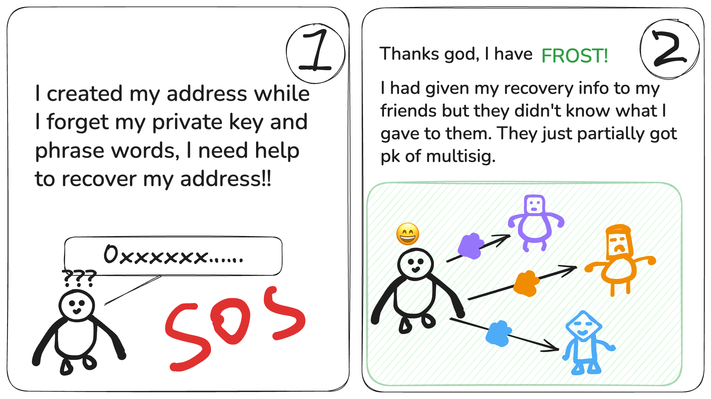

# blind-threshold-sig

### Motivation

Threshold signature has been widely adopted, though a downside is that the signers have full visibility into the message they are signing, which for certain uses cases leak privacy of the message owner. In this project, we implement a blind threshold signature scheme to enable secure and private social recovery mechanisms. Traditional social recovery relies on trusted signers who know the user's address or identity, posing privacy risks and potential collusion threats. Our scheme allows a user to distribute secret shares to a group of guardians, who can collectively help recover a wallet without ever learning the user's actual address or messages they are signing. By leveraging blindness and threshold security, we ensure that no single party can compromise the user’s privacy, and recovery is only possible when a predefined subset of guardians agree to sign.




### Overview

We use FROST (Flexible Round-Optimized Schnorr Threshold Signatures), a threshold signature scheme based on Schnorr signatures that allows a group of n participants to collaboratively produce a valid Schnorr signature using only a threshold t of their secret shares. It requires two rounds of communication: one for nonce commitment exchange, and one for signing.

Blinding can be added to FROST by having the blind signer uses public nonce (instead of the private hiding nonce), and the coordinator provides a challenge for the signer to sign with a blind Schnorr signature scheme.

We discuss in more details in this [HackMD document](https://hackmd.io/sFTnuusqTd2UGxZlD61wBQ).

### Getting Started

```
cargo run
```

We wrote an example to show the end to end flow of distributing the secret key through Shamir secret sharing, to the FROST signing flow and signature verification.


```
cargo test
```

There are also some unit tests in the modules.

#### Acknowledgements

The idea to implement a protype for blind threshold signature in inspired by an open problem by Daimo, written in the Blind Backups section [here](https://daimo.com/open-problems). We then came across well written materials here:
- [Private Collaborative Custody with FROST](https://gist.github.com/nickfarrow/4be776782bce0c12cca523cbc203fb9d)
- [RFC for Frost](https://www.rfc-editor.org/rfc/rfc9591.html#section-5)
